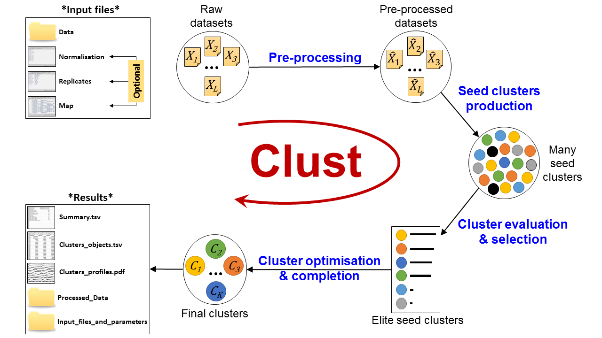
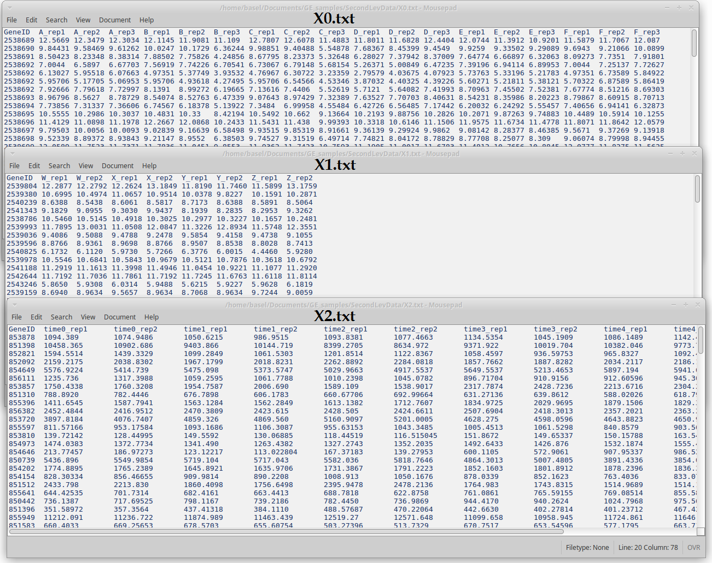

# Bi-CoPaM
The Bi-CoPaM identifies clusters (groups) of objects which are well-correlated with each other across a number of given datasets with minimal need for manual intervention.

*Figure 1: The Bi-CoPaM generates clusters (C0, C1, C2, ...) out of an input of 9,462 objects based on their profiles in three datasets (X0, X1, and X2). The left-hand panel shows the profiles of all 9,462 objects in each one of the three datasets, while the right-hand panel shows the profiles of the objects within each one of the clusters. The objects included in any given cluster are well-correlated with each other in each one of the three datasets. Note that the number of conditions or time points are different amongst the datasets.*

**Features!**

1. No need to filter your data before submission.
2. No need to preset the number of clusters; the algorithm finds it automatically.
3. The algorithm automatically filters out any objects that do not fit into any cluster.
4. You can control the tightness of the clusters simply by varying a parameter, which has a default value if you wish not to set it!
5. You can include heterogeneous datasets (e.g. gene expression datasets from different technologies, different species, different numbers of conditions, etc). Have a look at the **Simple usage** section.
5. The package calculates key statistics and provides them in the output.
6. A table of clusters' members is provided in an output TSV file.
7. A figure showing the profiles of the generated clusters is provided as an output PDF file.

## Automatic Bi-CoPaM analysis pipeline

*Figure 2: Automatic Bi-CoPaM analysis pipeline*

## Simplest usage
- `bicopam data_path`

This applies the Bi-CoPaM pipeline over the datasets with files included in the data_path directory with default parameters.

#### Data files
Each dataset is represented in a single TAB delimited (TSV) file in which the first column represents the identifiers
(IDs) of the objects (e.g. gene names), the first row represents unique labels of the samples (e.g. conditions or time
points), and the rest of the file includes numerical values of these objects at those samples. Figure 3 shows a screen 
shot of the first few lines of 3 datasets' files.

*Figure 3: Snapshots of three data files X0, X1, and X2.*

* When the same object ID appears in different datasets, it is considered to refer to the same object. For example, the
object ID O01 in the dataset X0 is considered to refer to the same object as O01 in the datasets X1 and X2.
* If more than one row in the same file had the same identifier, they are automatically summarised by summing up their values.

## 2nd level usage (replicates, normalisation, and ID maps (e.g. orthologues))
- `bicopam data_path  -r replicates_file -n normalisation_file -m map_file`

Consider the gene expression datasets shown in Figure 4:

*Figure 4: Snapshots of three gene expression datasets from two yeast species, X0 and X1 from fission yeast
(Schizosaccharomyces pombe) and X2 from budding yeast (Saccharomyces cerevisiae).*

These are three datasets from two species, two from fission yeast and one from budding yeast. There are few
issues in these datasets:

1. **Replicates:** There are multiple replicates for the same conditions. For example, X0 has 18 columns (samples) of
data, but every three of them represent replicates for a single condition. One does not want the Bi-CoPaM to consider 
these 18 columns as 18 independent conditions; rather one wants the Bi-CoPaM to summarise the replicates of each
condition to form a single column. This is done by providing the Replicates file (file format is below).
2. **Normalisation:** Different datasets require different normalisation procedures to be suitable for cluster analysis.
X0 and X1 for example have log2 values while X2 does not. By providing a simple normalisation file, one can direct the
Bi-CoPaM towards proper pre-processing of data. (file format is below).
3. **Mapping object IDs:** Fission yeast genes are not the same as budding yeast genes and have different gene ID.
Therefore, it is important to provide the algorithm with a file that maps fission yeast gene IDs to their orthologous
budding yeast gene IDs. Such mapping is required whenever the datasets objects' IDs are not mutual. For example, if
one dataset uses Entrez gene IDs while the other dataset uses gene names, a mapping file is required to inform the
algorithm that this or that Entrez gene ID refers to this or that gene name. (file format is below).

#### Replicates file

#### Normalisation file

#### Map file (e.g. inter-species orthologues)

*Figure 7: TAB delimited file which maps fission and budding yeast genes, i.e. defines orthologues across the
two species.*

The first column shows the orthologue/object group (OG) IDs, the second column shows the budding
yeast gene IDs which belong to these OG IDs while the third column shows the fission yeast gene IDs which
belong to these IDs. If more than one gene within the same species are orthologues, i.e. belong to the same OG
ID, they are included next to that OG ID in the column which belongs to that species while being separated by
commas; for example, the fission yeast genes 2541313 and 2543377 are orthologues to each other and are both
orthologues to the budding yeast gene 855993; these gene IDs are all included in the OG ID 29; see the sixth
line in Figure 7. In this case, both fission yeast genes 2541313 and 2543377 in the datasets of fission yeast
are summarised by summing them up. In other words, the algorithm considers one value for the OG ID 29 at each
sample in each dataset, and whenever this OG is represented by multiple rows in the same dataset, they are
summed up to a single row.

## Advanced usage

